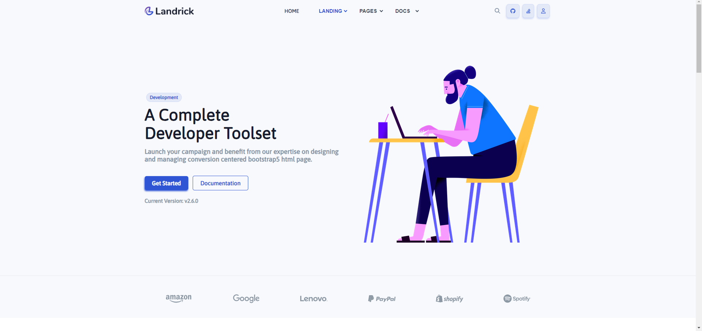

# Esercizio: Progetto HTML/VueJS

## Componenti:

### Header
- Componenti usati:
    - Menu
    - Logo
    - ButtonSm

### Main
- Componenti usati:
    - Jumbotron
    - Features
    - QuickStart
    - Subscriptions
    - Contact

### Footer
- Componenti usati:
    - Logo
    - ListIcon
    - ButtonSm
    - Button
    - ListaImg

### Menu
- Usato da:
    - Header

### Logo
- Props:
    - img
- Usato da:
    - Header
    - Footer

### ButtonSm
- Props:
    - icon
    - class
- Usato da:
    - Header
    - Footer

### Jumbotron
- Componenti usati:
    - Badge
    - Button
    - ListaImg
- Usato da:
    - Main

### Features
- Componenti usati:
    - Info
    - CardList
    - ListaImg
- Usato da:
    - Main

### QuickStart
- Componenti usati:
    - Info
    - Install
    - CardType
- Usato da:
    - Main

### Subscriptions
- Componenti usati:
    - Info
    - CardList
- Usato da:
    - Main

### Contact
- Componenti usati:
    - Info
    - Button
- Usato da:
    - Main

### ListIcon
- Props:
    - list
    - flex
    - listColor
- Usato da:
    - Footer
    - Install
    - CardType

### Button
- Props:
    - text
    - class
    - icon
    - size
- Usato da:
    - Footer
    - Contact
    - Jumbotron
    - CardType

### ListaImg
- Props:
    - flex
    - images
    - border
    - classT
- Usato da:
    - Footer
    - Jumbotron
    - Features

### Badge
- Props:
    - text
    - big
- Usato da:
    - Jumbotron
    - CardType

### Info
- Props:
    - align
    - titolo
    - descrizione
    - info
- Usato da:
    - Features
    - QuickStart
    - Subscriptions
    - Contact

### CardList
- Componenti usati:
    - CardType
- Props:
    - elements
    - type
    - icon
    - listColor
- Usato da:
    - Features
    - Subscriptions

### Install
- Componenti usati:
    - ListIcon
- Usato da:
    - QuickStart

### CardType
- Componenti usati:
    - ListIcon
    - Button
    - Badge
    - Best
- Props:
    - border
    - icon
    - title
    - description
    - link
    - list
    - button
    - type
    - btSize
    - infoP
    - badge
    - best
    - iconBt
    - listColor
- Usato da:
    - QuickStart
    - CardList